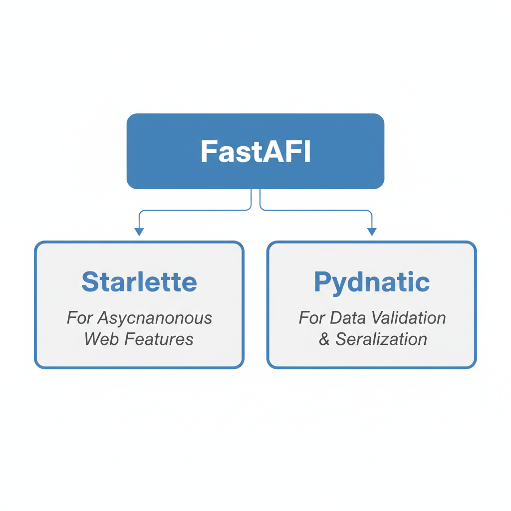
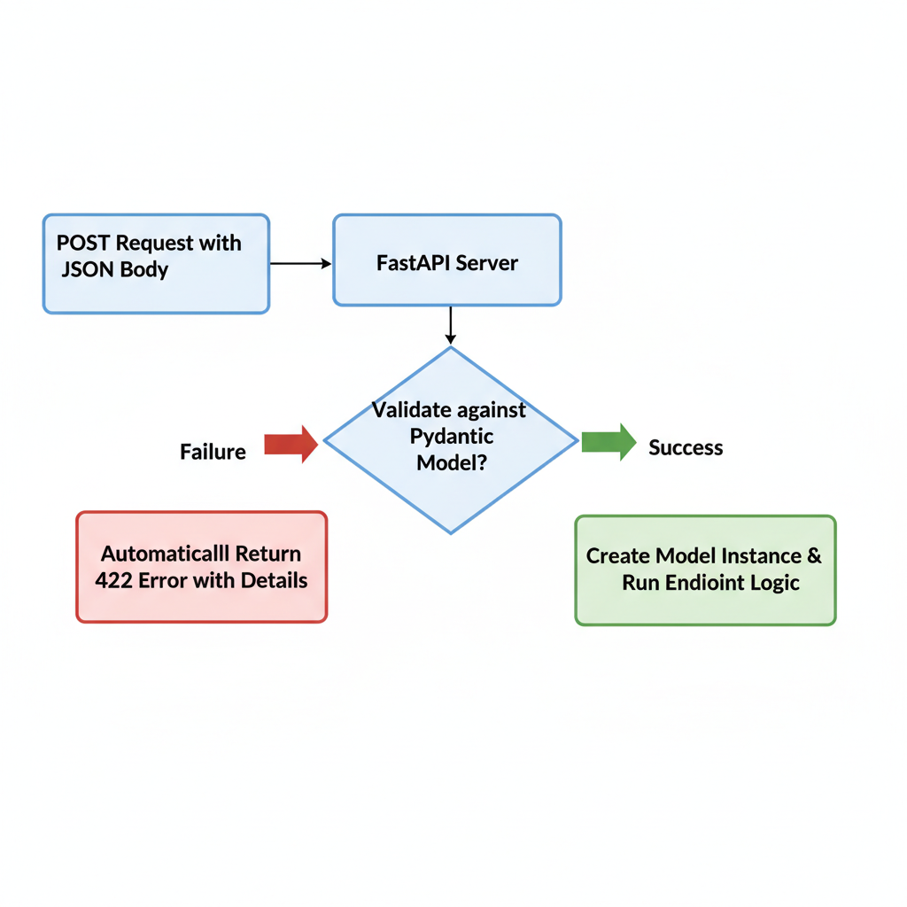
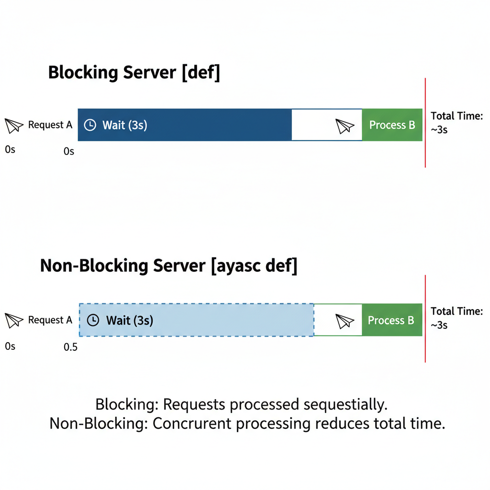

# Build Modern, Fast APIs with FastAPI in 2026

## Introduction: Why FastAPI?

If you're looking to build a new API with Python in 2026, FastAPI should be at the top of your list. It's a modern, high-performance web framework designed specifically for creating robust, production-ready APIs with remarkable ease and speed. But what makes it the go-to choice for so many developers today?

The advantages boil down to three core benefits. First, it's incredibly fast. FastAPI is built on top of Starlette for its asynchronous web components and Pydantic for data validation, making it one of the fastest Python frameworks available, on par with NodeJS and Go. Second, it provides an exceptional developer experience by leveraging standard Python type hints. These hints aren't just for static analysis; FastAPI uses them to handle data validation, serialization, and, most impressively, to automatically generate interactive API documentation. You get a fully compliant OpenAPI specification with Swagger UI and ReDoc interfaces for free, directly from your code.


*FastAPI combines the power of Starlette for async web performance and Pydantic for robust data handling.*

For developers coming from other ecosystems, FastAPI offers a compelling blend of features. If you've used Flask, you'll appreciate its minimalist, micro-framework feel. If you're familiar with Django REST Framework, you'll recognize the power of its built-in data validation, which feels like a more modern, type-hint-driven evolution of serializers.

In this tutorial, we'll move beyond the hype and get hands-on. We will guide you through building a simple but complete API endpoint from scratch, demonstrating the core features that make FastAPI so powerful and enjoyable to use.

## Setup and Your First Endpoint

Let's dive right in and get your first FastAPI application running. We'll start by setting up a clean development environment and then create a simple "Hello, World!" endpoint.

### Prerequisites and Environment

First, ensure you have a modern version of Python installed. As of early 2026, we strongly recommend using **Python 3.12+**, though FastAPI maintains compatibility with Python 3.10+.

To keep our project dependencies isolated, we'll use a virtual environment. Open your terminal in a new project folder and run the following commands:

```bash
# Create a virtual environment named 'venv'
python -m venv venv

# Activate it (macOS/Linux)
source venv/bin/activate

# Or activate it (Windows)
.\venv\Scripts\activate
```

With your virtual environment active, your terminal prompt should now be prefixed with `(venv)`.

### Install FastAPI and Uvicorn

Next, we'll install FastAPI and an ASGI server to run our application. We'll use Uvicorn, a lightning-fast server implementation. Install them both with a single `pip` command:

```bash
pip install "fastapi[all]"
```

The `[all]` option conveniently installs `uvicorn` along with other useful dependencies, giving you a great starting point.

### Create Your First API

Now, create a file named `main.py` in your project directory. This will be the entry point for our application. Open it and add the following code:

```python
# main.py
from fastapi import FastAPI

# Create an instance of the FastAPI class
app = FastAPI()

# Define a path operation decorator for a GET request to the root URL
@app.get("/")
def read_root():
    """This endpoint returns a simple welcome message."""
    return {"message": "Hello, World!"}
```

In just a few lines, we've imported `FastAPI`, created an application instance, and defined a GET endpoint at the root path (`/`) that returns a JSON response.

### Run the Development Server

You're ready to launch your API! Go back to your terminal and run the application using Uvicorn:

```bash
uvicorn main:app --reload
```

Here's what this command does:
- `main`: The file `main.py`.
- `app`: The `FastAPI` instance we created inside the file.
- `--reload`: This flag tells the server to automatically restart whenever you save changes to your code.

Uvicorn will start the server, typically on `http://127.0.0.1:8000`. Open this URL in your browser, and you should see your JSON response: `{"message":"Hello, World!"}`. Congratulations, you've just built your first API with FastAPI

## Path and Query Parameters

A powerful API needs to handle dynamic data sent directly in the URL. FastAPI makes this incredibly intuitive by distinguishing between **path parameters** for identifying specific resources and **query parameters** for filtering or configuration.

### Path Parameters: Identifying Resources

Path parameters are parts of the URL path used to point to a specific resource. For example, in a URL like `/items/42`, the number `42` is a path parameter identifying a unique item.

You declare them using the same f-string-like syntax in your path decorator. To capture the `item_id`, you define it as a function argument with a type hint. FastAPI uses this type hint for data validation.

```python
from fastapi import FastAPI

app = FastAPI()

@app.get("/items/{item_id}")
async def read_item(item_id: int):
    """
    Fetches an item by its ID.
    The value of {item_id} from the path is passed
    as the argument to the item_id parameter.
    """
    return {"item_id": item_id, "description": "This is a sample item."}
```

Here, FastAPI knows that the `item_id` in the path corresponds to the `item_id: int` argument. If a client tries to visit `/items/foo`, FastAPI will automatically return a clear JSON error response because "foo" is not a valid integer.

### Query Parameters: Filtering and Options

Query parameters are the key-value pairs that come after a `?` in the URL, used for filtering, sorting, or pagination. For instance, in `/items?skip=0&limit=10`, `skip` and `limit` are query parameters.

You declare query parameters simply by adding them as function arguments that are *not* part of the path. To make them optional, provide a default value.

```python
from fastapi import FastAPI

app = FastAPI()

# A dummy database for our example
fake_items_db = [{"item_name": f"Item {i}"} for i in range(50)]

@app.get("/items/")
async def read_items(skip: int = 0, limit: int = 10):
    """
    Lists items, with optional pagination.
    - `skip`: How many items to skip from the beginning.
    - `limit`: The maximum number of items to return.
    """
    return fake_items_db[skip : skip + limit]
```

In this example, visiting `/items/` will use the defaults `skip=0` and `limit=10`. A request to `/items/?skip=20&limit=5` will override these defaults.

By simply declaring these parameters with Python type hints, you unlock FastAPI's superpower: **automatic validation and documentation**. FastAPI parses the incoming request, converts the values to the declared type (`int` in our cases), and validates the data. Furthermore, it uses these definitions to generate a rich, interactive API schema (like OpenAPI), so your documentation is always perfectly in sync with your code.

## Handling Request Bodies with Pydantic

While `GET` requests are perfect for fetching data, creating or updating resources requires sending data *to* the server. Operations like `POST`, `PUT`, and `PATCH` typically include a "request body," often formatted as JSON, which contains the data to be processed. Manually parsing this JSON, validating its structure, and ensuring all required fields have the correct data types is tedious and error-prone. This is where FastAPI's superpower, its deep integration with the Pydantic library, truly shines ([Source](https://fastapi.tiangolo.com/tutorial/body/)).

Pydantic allows you to define complex data schemas using standard Python type hints. To declare the shape of your request body, you create a class that inherits from Pydantic's `BaseModel` ([Source](https://docs.pydantic.dev/latest/concepts/models/)). Let's define a simple `Item` model representing a product in an e-commerce system. This class explicitly declares that an item must have a string `name`, a floating-point `price`, and can optionally have a string `description`.

With our data model defined, we can use it directly in our path operation function. By declaring a function parameter and type-hinting it with our `Item` model, we instruct FastAPI to expect a request body that matches this structure.

This is where the magic happens. When a `POST` request is sent to `/items/`, FastAPI automatically:
1.  Reads the request body as JSON.
2.  Validates that the JSON's structure matches the `Item` model.
3.  Converts the data types (e.g., ensuring `price` is a `float`).
4.  If validation fails—for instance, if `price` is missing or is not a number—FastAPI immediately stops and returns a helpful `422 Unprocessable Entity` error, detailing exactly which field was invalid.
5.  If validation succeeds, it creates an instance of your `Item` class and passes it as the `item` argument to your function.


*FastAPI's automatic request validation flow using Pydantic models.*

Here's how it all comes together in code:

```python
from fastapi import FastAPI
from pydantic import BaseModel

app = FastAPI()

class Item(BaseModel):
    name: str
    description: str | None = None
    price: float
    tax: float | None = None

@app.post("/items/")
async def create_item(item: Item):
    """
    Receives an item JSON, validates it, and returns it.
    """
    # At this point, `item` is a Pydantic model instance.
    # You can access its data with dot notation.
    print(f"Received item: {item.name} with price ${item.price}")
    
    # You can easily convert the model back to a dict
    item_data = item.model_dump()
    
    if item.tax:
        total_price = item.price + item.tax
        item_data.update({"price_with_tax": total_price})
        
    return item_data
```

Inside `create_item`, you can now work with `item` as a clean, validated Python object. Access its attributes with `item.name` or `item.price` with full confidence in their existence and type. This declarative approach keeps your application code clean, robust, and focused on business logic, not boilerplate validation.

## Leveraging Asynchronous Operations

Modern APIs spend most of their time waiting—for database queries, third-party API calls, or file I/O. Asynchronous programming is a powerful paradigm that prevents your entire application from grinding to a halt during these waits. Instead of blocking a whole process, an `async` function can "pause" its work, allowing the server to handle other incoming requests. This concurrency is the secret behind FastAPI's impressive performance, and using it is surprisingly simple.

To see this in action, let's define an endpoint using Python's `async def` syntax. This tells FastAPI that the function can be paused and resumed.

```python
import asyncio
import time
from fastapi import FastAPI

app = FastAPI()

@app.get("/non-blocking")
async def read_items_non_blocking():
    """
    Simulates a non-blocking I/O call.
    The server can handle other requests while this one 'sleeps'.
    """
    print("Starting non-blocking task...")
    await asyncio.sleep(3) # Simulates waiting for a database or API
    print("Non-blocking task finished.")
    return {"message": "I'm done, and I didn't block anyone!"}

@app.get("/blocking")
def read_items_blocking():
    """
    Simulates a blocking call.
    The server is frozen until this completes.
    """
    print("Starting blocking task...")
    time.sleep(3) # This BLOCKS the entire server process
    print("Blocking task finished.")
    return {"message": "I'm done, but I held up the line."}
```

In the `/non-blocking` endpoint, `await asyncio.sleep(3)` simulates a slow network operation. When the program reaches this line, it yields control back to the server. The server is now free to process other requests, even starting another `/non-blocking` task, while the first one waits.

Contrast this with the `/blocking` endpoint, which uses the standard `time.sleep(3)`. This function is synchronous; it halts the entire execution thread. If you call this endpoint, your server will be completely unresponsive for three seconds. No other requests can be processed. This simple comparison illustrates the fundamental performance advantage of building your I/O-bound endpoints with `async def`.


*Visual comparison of blocking (synchronous) vs. non-blocking (asynchronous) request handling. The asynchronous server can handle new requests while waiting for I/O operations to complete.*

## Organizing Your Code with Dependency Injection

As your API grows, you'll notice patterns of repeated code. Imagine you have several endpoints that all need pagination. You might find yourself adding the same `skip: int = 0` and `limit: int = 100` query parameters to every path operation function. What happens when you want to add a search parameter `q` to all of them? You'd have to update each function individually. This same problem applies to common tasks like validating an API key from a header or fetching the current authenticated user from a token. This repetition makes your code harder to maintain and test.

FastAPI solves this elegantly with its powerful **Dependency Injection** system. Instead of repeating logic, you can encapsulate it in a separate function, called a "dependency," and have FastAPI "inject" the result into your endpoints.

Let's create a simple dependency to handle common pagination and search parameters. This is just a regular Python function:

```python
from typing import Annotated
from fastapi import Depends, FastAPI

app = FastAPI()

# This is our dependency function
async def common_query_params(q: str | None = None, skip: int = 0, limit: int = 100):
    """Processes and returns common query parameters."""
    return {"q": q, "skip": skip, "limit": limit}
```

Now, we can use `fastapi.Depends` to tell our path operations that they require this dependency. FastAPI will call `common_query_params`, handle the parameter extraction and validation, and pass the returned dictionary into our endpoint function.

```python
@app.get("/items/")
async def read_items(params: Annotated[dict, Depends(common_query_params)]):
    # The 'params' argument is the result from our dependency
    return {"message": "Fetching items", "params": params}

@app.get("/users/")
async def read_users(params: Annotated[dict, Depends(common_query_params)]):
    # This endpoint reuses the exact same logic!
    return {"message": "Fetching users", "params": params}
```

This approach has several major benefits:
*   **Cleaner Endpoint Logic**: Your path operation functions are now shorter and focus solely on their core business logic, rather than boilerplate parameter handling.
*   **Easier Testing**: During testing, you can easily override dependencies. You could, for example, replace a database dependency with a mock database or a user dependency with a hard-coded test user, isolating your tests to just the endpoint's logic.
*   **Centralized Business Logic**: All the logic for handling common parameters now lives in one place. If you need to change the default `limit` or add a new parameter, you only have to edit one function.

The system is even more powerful than this. Dependencies can be classes or can have their own dependencies, forming a complex graph of relationships that FastAPI automatically resolves for you before executing your endpoint code. This makes it a cornerstone for building robust, maintainable, and well-structured applications.

## Conclusion and Next Steps

Congratulations on building your first API with FastAPI! Throughout this tutorial, we've covered the framework's core concepts, from setting up routes with path and query parameters to ensuring data integrity using Pydantic models. You've seen how `async` and `await` enable high-performance, non-blocking operations and how the powerful Dependency Injection system helps manage application logic and resources cleanly. We also highlighted one of FastAPI's most beloved features: the automatically generated, interactive API documentation that makes testing and sharing your work incredibly simple.

Your journey doesn't end here. To build production-ready applications, your next steps should be exploring topics like:

*   **Database Integration:** Learn to connect your API to a database using modern libraries like SQLModel or the well-established SQLAlchemy.
*   **Error Handling & Middleware:** Implement custom middleware to handle logging, performance monitoring, and application-wide error responses.
*   **Authentication and Security:** Secure your endpoints using schemes like OAuth2 with JWT tokens.

To continue learning, the official documentation is an indispensable resource. It's comprehensive, full of examples, and considered the ultimate source of truth for the framework.

*   **Official FastAPI Documentation:** [https://fastapi.tiangolo.com/](https://fastapi.tiangolo.com/)
*   **FastAPI Tutorial - User Guide:** [https://fastapi.tiangolo.com/tutorial/](https://fastapi.tiangolo.com/tutorial/)
